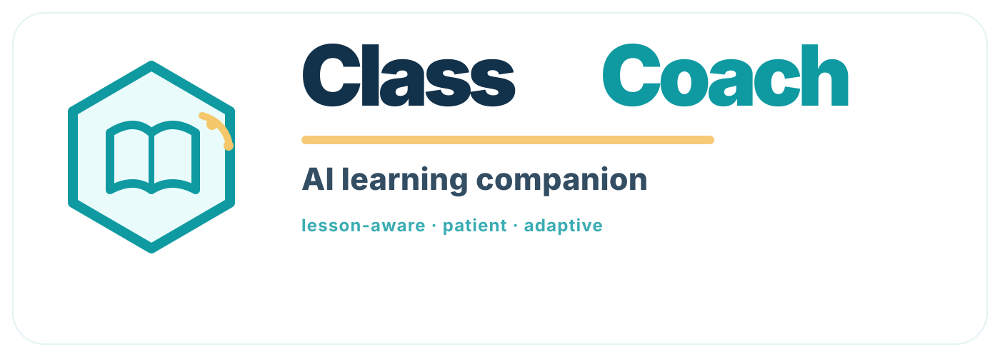

  

  

    
Class Coach product thesis

    <h1 class="dc-title">Understanding First</h1>
    
Demonstrate mastery in many forms, retain it over time, and use exams as calibration — not as the product itself.

  

  
Prepared by Sophie and Tom ThompsonUnderstanding-first Class Coach deck

---

<iframe class="dc-component-frame" src="../components/classcoach-understanding-first-contrast.html" title="Old way versus understanding-first education"></iframe>

---

  
The key shift

  

    

      <h2>The product is not the exam.</h2>
      
The product is proving understanding well enough that the exam becomes the benchmark.

    

    

      <h3>What changes</h3>
      <ul>
        <li>Class Coach teaches and probes for understanding before exam technique.</li>
        <li>Exam-style tasks are used periodically to calibrate readiness.</li>
        <li>The student is not judged by one day alone; evidence accumulates across time.</li>
        <li>Parents see pace, risk and next moves while the learning is still fixable.</li>
      </ul>
    

  

  
If understanding is real, durable and transferable, exam performance should become the consequence.

---

  
What counts as proof

  <h2>Understanding has to show up in more than one format.</h2>
  

    <article class="dc-card"><h3>Explain it</h3>
The student can say why the concept works in their own words.
</article>
    <article class="dc-card"><h3>Transfer it</h3>
They can apply the idea to a new example, not just the rehearsed one.
</article>
    <article class="dc-card"><h3>Build it</h3>
A tiny app, model, diagram or generated image makes the concept manipulable.
</article>
  

  

    <article class="dc-card"><h3>Challenge it</h3>
They can spot misconceptions, traps and false patterns.
</article>
    <article class="dc-card"><h3>Teach it back</h3>
They can help the AI or another learner see the idea clearly.
</article>
    <article class="dc-card"><h3>Retrieve it later</h3>
They can bring it back after time has passed, without being led.
</article>
  

---

<iframe class="dc-component-frame" src="../components/classcoach-understanding-evidence-loop.html" title="Class Coach understanding evidence loop"></iframe>

---

<iframe class="dc-component-frame" src="../components/classcoach-understanding-plan-board.html" title="Class Coach parent progress plan and retention board"></iframe>

---

  
Teacher reports and evidence integrity

  

    

      <h2>Teachers should not need an exam setting to know where the class is.</h2>
      
Progress, homework, stale topics and misconceptions — reported as permitted learning evidence.

    

    

      <h3>Integrity checks for higher-stakes evidence</h3>
      <ul>
        <li>Short oral checks with consented speaker verification.</li>
        <li>Response timing in voice or text as a confidence signal.</li>
        <li>Consistency with the learner’s wider understanding trail.</li>
        <li>Human review when a signal affects a badge or intervention.</li>
      </ul>
      
Frame this as evidence integrity, not surveillance: proportionate, consented, policy-governed and never based on one signal alone.

    

  

---

  
Memory management

  

    

      <h2>Retention is part of the product.</h2>
      
Class Coach should revisit topics before they fade — and teach the student how to remember better.

    

    

      <h3>Memory loop</h3>
      <ul>
        <li>Schedule spaced retrieval for concepts at risk of decay.</li>
        <li>Interleave old and new topics so knowledge stays flexible.</li>
        <li>Teach active recall, chunking, visual hooks and memory palace methods where useful.</li>
        <li>Use delayed checks as evidence of durable understanding.</li>
      </ul>
    

  

---

<iframe class="dc-component-frame" src="../components/classcoach-understanding-team-teaching.html" title="Class Coach team teaching roles"></iframe>

---

  
Expert modules

  <h2>Some modules can be AI-native books.</h2>
  

    <article class="dc-card"><h3>Author method</h3>
An expert provides the method, examples, constraints, rubric and practice pathway.
</article>
    <article class="dc-card"><h3>Interactive coach</h3>
The AI teaches the method on the student's real school content and adapts the practice.
</article>
    <article class="dc-card"><h3>Feedback channel</h3>
With permission, subscription feedback can help the author or expert team improve the module.
</article>
  

  
Instead of buying only a book, the student gets a method that watches them practise.

---

  
Badges

  

    

      <h3>A badge should say what was proven</h3>
      <ul>
        <li>concept or capability;</li>
        <li>evidence types completed;</li>
        <li>transfer and misconception checks;</li>
        <li>delay / retention period;</li>
        <li>module provenance and renewal rule.</li>
      </ul>
    

    

      <h2>Not “I completed the lesson.”</h2>
      
“I demonstrated understanding under these conditions, and I retained it over time.”

      
Badges support parents, teachers and students. They do not replace official qualifications or teacher judgement.

    

  

---

  
Long-term evidence

  <h2>Assessment can happen over time, not only on one day.</h2>
  

    <article class="dc-card"><h3>Week 1</h3>
The student can explain the concept immediately after learning.
</article>
    <article class="dc-card"><h3>Week 3</h3>
The student can retrieve it after delay and apply it in a fresh setting.
</article>
    <article class="dc-card"><h3>Week 6</h3>
An exam-style calibration checks whether the evidence predicts readiness.
</article>
  

  
The best proof is not a single performance. It is understanding that survives time, context changes and pressure.

---

  
Closing promise

  

    

      <h2>Understand first. Prove it over time.</h2>
      
Then use the exam as the benchmark.

    

    

      <h3>Class Coach becomes</h3>
      <ul>
        <li>a concept illustrator;</li>
        <li>a memory coach;</li>
        <li>a team-teaching layer;</li>
        <li>a parent progress plan;</li>
        <li>a durable understanding evidence system.</li>
      </ul>
    

  

