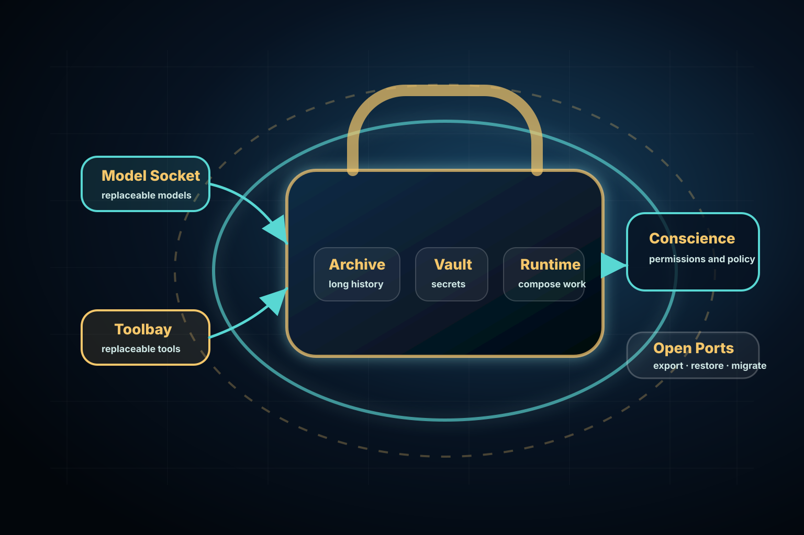

  
  
Dreamcatcher

  

    
Prepared for Kristin School

    <h1 class="dc-title">Ark Components</h1>
    
An open, self-sovereign architecture for durable personal AI: a person-owned Ark, a live Agent, a Conscience boundary, Archive, Vault, Model Socket, Toolbay, Open Ports, and Outlast continuity.

  

  
Prepared by Tom Thompson · tom@DreamCatcher.aiParent of Harry Thompson (Junior School applicant, unconfirmed)

---

  
What an Ark is

  

    

      <h2>A portable operating system for continuity.</h2>
      
An Ark carries precious continuity for its owner — the person, family, or institution it serves.

    

    

      <h3>What it represents</h3>
      
Durable, portable, protected, and specific enough to build around. The Ark is the owner’s long-running home for history, permissions, the Agent, tools, models, and carefully governed action.

      
continuitycustodyportabilityprotectionownership

    

  

---

  
Ark + Agent

  <h2>The Ark is the owned place. The Agent is the live experience.</h2>
  

    
<h3>Ark</h3>
The Ark holds continuity: history, custody, permissions, provenance, recovery, and the owner’s long-running context.

    
<h3>Agent</h3>
The Agent works inside and with the Ark. It can speak, plan, act, ask, and explain — but it is not the whole Ark and it is not just the model.

    
<h3>Replaceable capabilities</h3>
Models plug into the Model Socket. Tools and services plug into the Toolbay. The Conscience governs both.

  

---

<iframe class="dc-component-frame" src="../components/ark-components-architecture-cycle.html" title="Ark components architecture diagram variants"></iframe>

---

  
Archive and Vault

  

    
<h3>Archive</h3>
The long-running history: work, learning evidence, projects, feedback, values, preferences, decisions, provenance, and reflections.

The Archive is how continuity compounds over years.

    
<h3>Vault</h3>
The tightly constrained chamber for sensitive material: credentials, keys, payment rails, recovery material, biometrics, private records, and high-risk permissions.

The Vault answers, redacts, or refuses without casually exposing raw secrets.

  

---

  
Sockets and bays

  

    

      <h2>Modular by design.</h2>
      
The Agent should be able to change models, tools, and services without the owner starting again.

    

    

      <h3>The operating posture</h3>
      <ul>
        <li>the Agent works in and with the Ark;</li>
        <li>models plug into the Model Socket;</li>
        <li>tools and services plug into the Toolbay;</li>
        <li>the Archive preserves long context;</li>
        <li>the Vault stays private and constrained;</li>
        <li>the Conscience governs movement across boundaries.</li>
      </ul>
    

  

---

  
Conscience

  

    

      <h2>The boundary with judgement.</h2>
      
The Conscience governs flows into, out of, and within the Ark.

    

    

      <h3>It checks and explains</h3>
      <ul>
        <li>owner permissions, age, role, law, policy, safety, privacy, and cost;</li>
        <li>what a model may see;</li>
        <li>what a tool may do;</li>
        <li>what a parent, teacher, child, or external service may receive.</li>
      </ul>
    

  

---

  
Open Ports

  <h2>Ownership is proved by leaving, inspecting, and restoring.</h2>
  

    
<h3>Open source where possible</h3>
Underlying mechanisms should be understandable, reviewable, and replaceable rather than trapped behind a vendor wall.

    
<h3>Protocol-shaped exits</h3>
Export, restore, migration, permission grants, and audit trails should be protocol-shaped, not screenshot-shaped.

    
<h3>Owner control</h3>
The Ark belongs to its owner. Institutions can contribute and verify without taking ownership.

  

---

  
App locality

  <h2>Bring the app to the Ark, not your life to the app.</h2>
  

    
<h3>Old SaaS</h3>
The application became the useful place, so the person’s records, identity, history, and permissions were pulled outward into vendor accounts.

    
<h3>Ark-centred</h3>
Data, keys, history, policy, and provenance stay unified in the Ark. Apps, models, tools, and services become the interchangeable parts.

    
<h3>Conscience-gated</h3>
Services can still provide transport, backup, inference, coordination, publishing, and recovery — but they cross a governed boundary.

  

---

  
Outlast

  

    

      <h3>The promise</h3>
      
The Ark should outlast the model, the tool, the app, the school year, the vendor contract, and the device.

      
exportrestoremigrateauditrevoke

    

    

      <h2>Continuity is the product.</h2>
      
Models, tools, apps, and services are replaceable capabilities around the person-owned Ark.

    

  

---

  
Not only students

  <h2>An Ark can be assigned to any person.</h2>
  

    
<h3>Child Ark</h3>
Learning history, support, reflection, age-appropriate permissions, and carefully bounded help.

    
<h3>Parent Ark</h3>
Family context, values, records, lived judgement, resource coordination, and safe contribution to the child’s world.

    
<h3>Teacher Ark</h3>
Learning design, feedback, classroom evidence, professional memory, and school-approved channels into student work.

  

---

<iframe class="dc-component-frame" src="../components/ark-community-ecosystem-cycle.html" title="Permissioned community of parent, teacher, and child Ark diagrams"></iframe>

---

  
Reference sentence

  <h2>The Ark is the owned continuity layer.</h2>
  
Archive remembers. Vault protects. Agent works. Conscience governs. Model Socket and Toolbay make capabilities replaceable. Open Ports prove ownership. Outlast is the promise.

