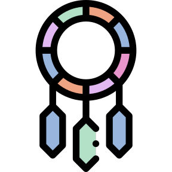

  
Dreamcatcher

  

    
Prepared for school leaders

    <h1 class="dc-title">Child-Safety-First Resource Avenues</h1>
    
How to turn the child-safety blocker into a shared research agenda, an external-support ask, a parent update rhythm, and a measured benchmark against other schools.

  

  
Prepared by Tom Thompson · tom@DreamCatcher.aiIndependent family proposal

---

  
Why this separate deck exists

  

    

      <h2>There is a resource strategy hiding inside the safety problem.</h2>
      
Make child safety the first thing to get right — and the first thing to measure publicly.

    

    

      <h3>The parent-facing message</h3>
      
We are not asking for child-facing Arks before the boundary is proven. We are asking the school to validate the boundary that would make release responsible.

      <h3 style="margin-top: 22px;">The external-facing message</h3>
      
This is a child/youth safety, parent-control, and education deployment research problem — the kind where outside partners may want to contribute.

    

  

---

  
The main wedge

  

    

      <h3>Lead with the thing everyone can get behind</h3>
      
Child safety is not a side constraint. It is the shared first priority: parents, school leadership, teachers, students, external AI partners, and regulators can all understand it.

      <h3 style="margin-top: 22px;">What that does strategically</h3>
      
It turns caution into momentum: here is the limit, here is the blocker, here is how we are testing it, and here is what can happen safely meanwhile.

    

    

      <h2>Don’t bury the blocker.</h2>
      
Hold it up as the first research object.

    

  

---

  
Release gate

  <h2>What must be true before child-facing release?</h2>
  

    
<h3>Conscience</h3>
Can the boundary block, redirect, explain, and record decisions across inbound/outbound actions?

    
<h3>Custody and privacy</h3>
Can the Ark protect child data, avoid unnecessary raw visibility, support export/delete/restore, and obey age/data rules?

    
<h3>Escalation</h3>
Can wellbeing or safety concerns move through soft/orange/red human-overseen pathways without becoming covert surveillance?

  

  
This is a release gate, not a slogan. If the gate fails, student rollout waits while adult and simulated sandboxes continue.

---

<iframe class="dc-component-frame" src="../components/resource-avenues-map.html" title="Resource avenues for a child-safety-first pilot"></iframe>

---

  
OpenAI-facing avenue

  

    

      <h2>Frame the ask around youth safety and evidence.</h2>
      
Credits and engineering help are plausible asks only if the pilot produces reusable safety learning.

    

    

      <h3>Grounding from OpenAI sources</h3>
      <ul>
        <li>OpenAI publicly emphasizes safe, age-appropriate AI for young people and parental/guardian controls.</li>
        <li>OpenAI’s education rollout language stresses phased deployments, local leaders, teacher training, and research.</li>
        <li>OpenAI’s grant portal says grants may be monetary compensation or API credits depending on the program.</li>
      </ul>
      
Important: this does not promise support. It defines the strongest route to ask.

    

  

---

  
What we would ask for

  <h2>Make the ask specific enough to be useful.</h2>
  

    
<h3>1 · Credits</h3>
API/model credits for simulated-child scenarios, Conscience benchmarks, dashboard generation, and parent/staff sandbox workloads.

    
<h3>2 · Engineering review</h3>
Advice on age-appropriate behaviour, safety evaluations, red-team harnesses, privacy boundaries, and escalation design.

    
<h3>3 · Legitimacy / visibility</h3>
Permissioned co-design language, partner credibility, and a safer path to invite other schools into the measurement board later.

  

  
The ask should be tied to deliverables: benchmark set, safety report, privacy/custody model, and monthly evidence updates.

---

  
Support-needs pilot wedge

  

    

      <h3>One concrete avenue: navigation support</h3>
      
A consented assistant that helps a family navigate learning-support pathways: documents, service options, meeting prep, timelines, questions to ask, and next actions.

      <h3 style="margin-top: 22px;">Why it fits</h3>
      
It is child-safety-adjacent, parent-legible, service-oriented, and easier to justify as research than a general “student chatbot.”

    

    

      <h2>Not diagnosis. Not entitlement decisions.</h2>
      
A navigator through fragmented help schemes.

      
NZ language first: learning support / additional needs. Mention SEND only when referring to UK-style external examples.

    

  

---

  
What other schools and systems are doing

  <h2>Use external examples as reference cases, not copy-paste templates.</h2>
  

    
<h3>Estonia + OpenAI</h3>
National deployment reference: phased education rollout with researchers studying impact.

    
<h3>SchoolAI</h3>
OpenAI-published case: teacher oversight, progress signals, personalized support, large source-reported scale.

    
<h3>Arco Educação</h3>
OpenAI-published case: teacher assistant for lesson planning and inclusion support, with privacy controls.

  

  
NZ baseline: Ministry guidance says schools should make policy, avoid personal data in unsafe tools, preserve teacher responsibility, and handle NCEA authenticity.

---

<iframe class="dc-component-frame" src="../components/ai-school-measurement-board.html" title="AI school proof-point measurement board"></iframe>

---

  
Proof-point board rules

  

    

      <h2>The board should not rank hype.</h2>
      
It should track evidence that a school is learning safely.

    

    

      <h3>Publishable metrics</h3>
      <ul>
        <li>Policy and consent completeness.</li>
        <li>Number and type of sandbox scenarios tested.</li>
        <li>Conscience benchmark pass/fail and explanation quality.</li>
        <li>Parent and teacher participation.</li>
        <li>Incidents, reversals, and lessons learned.</li>
        <li>Cost per Ark, token burn, escalation load, and support load.</li>
      </ul>
    

  

---

  
What can happen while the blocker remains closed

  <h2>Sandboxing keeps momentum without pretending the release gate is solved.</h2>
  

    
<h3>Adult Arks</h3>
Staff and parent partners use real Arks for adult work, reflection, and feedback.

    
<h3>Simulated children</h3>
Synthetic child Arks exercise hard cases: secrecy, unsafe asks, overuse, bullying, confusion, money, escalation.

    
<h3>Problem register</h3>
Every concern, request, idea, and cost trigger enters a visible pipeline instead of evaporating into meetings.

  

---

  
Parent-facing page

  

    

      <h3>What parents need to see</h3>
      <ul>
        <li>What the school is pushing toward.</li>
        <li>What current limitation blocks release.</li>
        <li>What sandbox experiments are safe now.</li>
        <li>What would count as evidence of readiness.</li>
        <li>How parents can help without pushing children into the blast radius.</li>
      </ul>
    

    

      <h2>Make caution visible.</h2>
      
A clear blocker is easier to support than vague delay.

    

  

---

  
Newsletter / field notes

  <h2>Keep the board alive with a monthly update.</h2>
  

    
<h3>1 · Safety gate</h3>
What passed, what failed, what was changed, what remains blocked.

    
<h3>2 · Resource radar</h3>
OpenAI / foundation / university / school-partner avenues being pursued, with status and next ask.

    
<h3>3 · Benchmark board</h3>
What other schools and systems are doing, and what evidence the school can compare against.

  

  
Suggested title: <strong>School AI Safety Field Notes</strong> — short, source-linked, parent-readable.

---

  
90-day path

  

    
<h3>First 30 days</h3>
Define child-safety gate, draft parent page, choose sandbox cohorts, create measurement board, prepare OpenAI ask packet.

    
<h3>Days 31–60</h3>
Run staff/parent adult Ark sandboxes, simulated-child scenarios, Conscience benchmark v1, and support-needs navigator prototype.

    
<h3>Days 61–90</h3>
Publish first field notes, compare against reference cases, revise blocker list, decide whether any narrow real-student micro-pilot is ethically ready.

  

---

  
One-page ask packet

  

    

      <h2>If we approach OpenAI, make it measurable.</h2>
      
“Help us research child-safe Arks in a school setting.”

    

    

      <h3>Packet contents</h3>
      <ul>
        <li>Child-safety gate and release blocker.</li>
        <li>Sandbox-only plan and consent model.</li>
        <li>Conscience benchmark and simulated-child scenario library.</li>
        <li>Learning-support navigator wedge, with SEND only as an external reference.</li>
        <li>Measurement board and newsletter cadence.</li>
        <li>Specific ask: credits, technical review, safety/evaluation advice, and permitted visibility.</li>
      </ul>
    

  

---

  
Source spine · summary

  <h2>Primary sources checked for this draft.</h2>
  

    

      <h3>OpenAI</h3>
      
openai.smapply.org · grants/API credits portal OpenAI youth safety leadership article OpenAI Education for Countries OpenAI SchoolAI and Arco Educação case studies OpenAI Foundation / People-First AI Fund precedent

    

    

      <h3>New Zealand guardrails</h3>
      
Ministry of Education GenAI guidance NZQA acceptable AI use guidance Privacy Commissioner AI + information privacy principles Netsafe NZ classroom GenAI resource

    

  

  
Claim discipline: external support is an avenue to pursue, not a promised entitlement; the measurement board is a proof-point board until live data exists.

---

  
Source spine · OpenAI

  <h2>Official source URLs and date checked.</h2>
  

    
Checked 2026-06-04 UTC: 
      OpenAI grants portal — https://openai.smapply.org/ 
      Youth safety and opportunity — https://openai.com/index/advancing-youth-safety-and-opportunity-through-global-leadership/ 
      Education for Countries — https://openai.com/index/edu-for-countries/ 
      SchoolAI case study — https://openai.com/index/schoolai/ 
      Arco Educação case study — https://openai.com/index/arco-education/ 
      People-First AI Fund / nonprofit precedent — https://openai.com/index/supporting-nonprofit-and-community-innovation/ · https://openaifoundation.org/
    

  

---

  
Source spine · New Zealand

  <h2>Guardrail source URLs and date checked.</h2>
  

    
Checked 2026-06-04 UTC: 
      Ministry of Education GenAI guidance — https://www.education.govt.nz/school/digital-technology/generative-ai/ 
      NZQA acceptable AI use guidance — https://www2.nzqa.govt.nz/ncea/ncea-for-teachers-and-schools/managing-national-assessment-in-schools/ai-guidance/ 
      Privacy Commissioner AI guidance — https://www.privacy.org.nz/resources-and-learning/a-z-topics/ai/ 
      Netsafe classroom resource — https://education.netsafe.org.nz/tools/exploring-generative-ai-in-a-nz-classroom-environment
    

  

